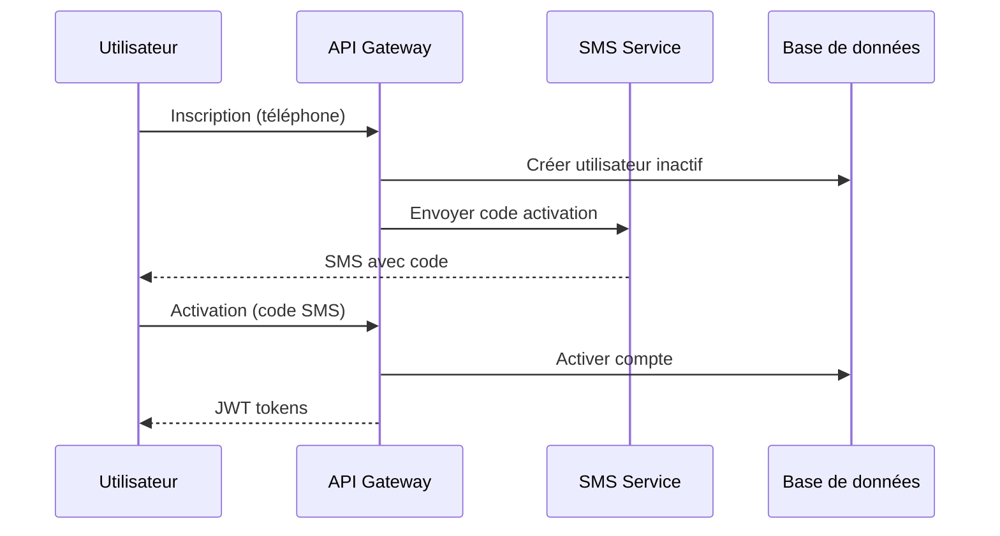
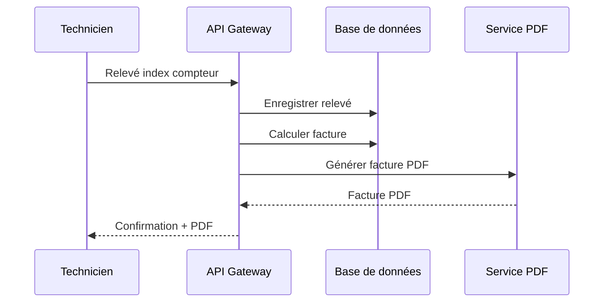

# 💧 WaterBill - Documentation Fonctionnelle Professionnelle

## 📋 Table des matières

- [🎯 Vue d'ensemble](#-vue-densemble)
- [🏢 Contexte métier](#-contexte-métier)
- [🔧 Architecture fonctionnelle](#-architecture-fonctionnelle)
- [👥 Gestion des utilisateurs](#-gestion-des-utilisateurs)
- [📊 Gestion de la facturation](#-gestion-de-la-facturation)
- [📱 Système d'authentification](#-système-dauthentification)
- [🔐 Sécurité et conformité](#-sécurité-et-conformité)
- [📈 Fonctionnalités avancées](#-fonctionnalités-avancées)
- [🌍 Spécificités géographiques](#-spécificités-géographiques)
- [📱 Interface utilisateur](#-interface-utilisateur)
- [🔧 Administration et maintenance](#-administration-et-maintenance)
- [📊 Reporting et analytics](#-reporting-et-analytics)
- [🚀 Déploiement et scalabilité](#-déploiement-et-scalabilité)
- [📞 Support et formation](#-support-et-formation)

---

## 🎯 Vue d'ensemble

**WaterBill** est une solution complète de gestion de facturation d'eau conçue spécifiquement pour les contextes où l'accès à l'email n'est pas universel. La plateforme utilise l'authentification par numéro de téléphone avec activation SMS, rendant le système accessible à tous les utilisateurs, indépendamment de leur niveau de connectivité internet.

### **🎯 Mission**

Fournir une solution de facturation d'eau moderne, sécurisée et accessible, adaptée aux besoins des pays en développement et des zones avec une connectivité internet limitée.

### **🌍 Vision**

Transformer la gestion de la facturation d'eau en une expérience numérique fluide et inclusive, en utilisant les technologies mobiles comme point d'entrée principal.

### **💡 Valeurs clés**

- **Accessibilité** : Interface adaptée aux utilisateurs avec peu d'expérience numérique
- **Sécurité** : Protection des données personnelles et financières
- **Fiabilité** : Système robuste fonctionnant dans des conditions réseau variables
- **Évolutivité** : Architecture modulaire permettant l'expansion future
- **Conformité** : Respect des réglementations locales et internationales

---

## 🏢 Contexte métier

### **🎯 Problématiques résolues**

#### **1. 🌐 Barrière numérique**

- **Problème** : Beaucoup d'utilisateurs n'ont pas d'adresse email fiable
- **Solution** : Authentification par numéro de téléphone mobile

#### **2. 📱 Accessibilité mobile**

- **Problème** : Accès limité aux ordinateurs, mais forte pénétration mobile
- **Solution** : Interface optimisée pour smartphones et tablettes

#### **3. 🔒 Sécurité des données**

- **Problème** : Gestion manuelle des factures = risques de perte/fraude
- **Solution** : Système digitalisé avec audit trail complet

#### **4. 📊 Traçabilité**

- **Problème** : Difficulté à suivre l'historique de consommation
- **Solution** : Historique complet et analytics de consommation

### **👥 Cibles utilisateurs**

#### **🏠 Clients finaux (Consommateurs)**

- **Profil** : Propriétaires et locataires de logements
- **Besoins** : Consultation des factures, historique de consommation, paiement en ligne
- **Appareils** : Smartphones Android/iOS, tablettes

#### **🏢 Gestionnaires de copropriété**

- **Profil** : Syndics, gérants d'immeubles
- **Besoins** : Gestion multi-logements, rapports consolidés, suivi des paiements
- **Appareils** : Tablettes, ordinateurs portables

#### **🏛️ Opérateurs d'eau**

- **Profil** : Sociétés de distribution d'eau
- **Besoins** : Gestion centralisée, analytics, intégration systèmes existants
- **Appareils** : Systèmes d'entreprise, tableaux de bord

#### **🔧 Techniciens de terrain**

- **Profil** : Agents de relevé, techniciens maintenance
- **Besoins** : Application mobile de relevé, synchronisation offline
- **Appareils** : Smartphones robustes, tablettes terrain

---

## 🔧 Architecture fonctionnelle

### **📱 Applications métier**

#### **1. 👥 Application Users (Authentification)**

- **Rôle** : Gestion des identités et accès
- **Fonctionnalités** :
  - Inscription par numéro de téléphone
  - Activation par SMS sécurisée
  - Authentification JWT
  - Gestion des profils utilisateurs
  - Support multi-rôles (client, gestionnaire, technicien, admin)

#### **2. 💧 Application Core (Services partagés)**

- **Rôle** : Fonctionnalités transverses
- **Fonctionnalités** :
  - Configuration système
  - Utilitaires communs
  - Endpoints de santé (health checks)
  - Gestion des erreurs centralisée
  - Logging et monitoring

#### **3. 📊 Application Billing (Facturation)**

- **Rôle** : Gestion de la facturation d'eau
- **Fonctionnalités** :
  - Gestion des compteurs d'eau
  - Relevés d'index
  - Calcul automatique des factures
  - Génération de PDF
  - Historique de consommation
  - Gestion des tarifs

### **🏗️ Architecture technique**

```
┌─────────────────┐    ┌─────────────────┐    ┌─────────────────┐
│   Frontend      │    │   API Gateway   │    │   Microservices │
│   (Mobile/Web)  │◄──►│   (Django DRF)  │◄──►│   (Users/Core/  │
│                 │    │                 │    │    Billing)     │
└─────────────────┘    └─────────────────┘    └─────────────────┘
         │                       │                       │
         │                       │                       │
         ▼                       ▼                       ▼
┌─────────────────┐    ┌─────────────────┐    ┌─────────────────┐
│   SMS Gateway   │    │   Redis Cache   │    │   PostgreSQL    │
│   (Twilio)      │    │   (Throttling)  │    │   (Données)     │
└─────────────────┘    └─────────────────┘    └─────────────────┘
```

### **🔄 Flux de données**

#### **1. 📱 Flux d'authentification**



#### **2. 💧 Flux de facturation**



---

## 👥 Gestion des utilisateurs

### **📱 Profils utilisateurs**

#### **🏠 Client Standard**

- **Accès** : Ses propres factures uniquement
- **Fonctionnalités** :
  - Consultation des factures
  - Historique de consommation
  - Téléchargement des PDF
  - Notifications SMS
  - Mise à jour du profil

#### **🏢 Gestionnaire de copropriété**

- **Accès** : Tous les logements de sa copropriété
- **Fonctionnalités** :
  - Vue d'ensemble multi-logements
  - Rapports consolidés
  - Suivi des paiements
  - Gestion des locataires
  - Alertes de consommation anormale

#### **🔧 Technicien de terrain**

- **Accès** : Relevés et maintenance
- **Fonctionnalités** :
  - Application mobile de relevé
  - Synchronisation offline
  - Photos des compteurs
  - Signalement d'anomalies
  - Planning de tournées

#### **👑 Administrateur système**

- **Accès** : Toutes les fonctionnalités
- **Fonctionnalités** :
  - Gestion des utilisateurs
  - Configuration des tarifs
  - Monitoring système
  - Rapports avancés
  - Maintenance système

### **🔐 Système de permissions**

| Fonctionnalité            | Client          | Gestionnaire      | Technicien  | Admin       |
| ------------------------- | --------------- | ----------------- | ----------- | ----------- |
| **Consultation factures** | ✅ Ses factures | ✅ Sa copropriété | ❌          | ✅ Toutes   |
| **Relevés compteurs**     | ❌              | ✅ Lecture seule  | ✅ Modifier | ✅ Toutes   |
| **Gestion utilisateurs**  | ❌              | ✅ Sa copropriété | ❌          | ✅ Tous     |
| **Configuration tarifs**  | ❌              | ❌                | ❌          | ✅          |
| **Rapports avancés**      | ❌              | ✅ Basiques       | ✅ Terrain  | ✅ Complets |

---

## 📊 Gestion de la facturation

### **💧 Types de compteurs supportés**

#### **📊 Compteurs mécaniques traditionnels**

- **Description** : Compteurs à roues dentées classiques
- **Relevé** : Manuel par lecture visuelle
- **Précision** : ±2% selon l'état du compteur
- **Maintenance** : Révision périodique recommandée

#### **📱 Compteurs électroniques**

- **Description** : Compteurs avec affichage numérique
- **Relevé** : Manuel ou automatique (si connecté)
- **Précision** : ±1% avec auto-diagnostic
- **Maintenance** : Moins fréquente, diagnostics intégrés

#### **🌐 Compteurs connectés (IoT)**

- **Description** : Compteurs avec transmission automatique
- **Relevé** : Automatique via réseau IoT
- **Précision** : ±0.5% avec transmission temps réel
- **Maintenance** : Préventive basée sur télémétrie

### **📈 Calcul des factures**

#### **🏗️ Structure tarifaire**

```python
# Exemple de structure tarifaire progressive
TARIFS_EUROS_PAR_M3 = {
    "tranche_1": {  # 0-10 m³
        "limite": 10,
        "prix": 1.50,
        "description": "Consommation de base"
    },
    "tranche_2": {  # 11-30 m³
        "limite": 30,
        "prix": 2.00,
        "description": "Consommation normale"
    },
    "tranche_3": {  # 31+ m³
        "limite": None,
        "prix": 2.50,
        "description": "Consommation élevée"
    }
}
```

#### **💰 Composantes de la facture**

| Composante           | Description                | Calcul                              |
| -------------------- | -------------------------- | ----------------------------------- |
| **Consommation**     | Volume d'eau utilisé       | (Index actuel - Index précédent)    |
| **Abonnement**       | Frais fixes mensuels       | Montant fixe selon type de logement |
| **TVA**              | Taxe sur la valeur ajoutée | Pourcentage sur le total            |
| **Frais de service** | Frais de gestion           | Montant fixe par facture            |
| **Pénalités**        | Retard de paiement         | Pourcentage + montant fixe          |

#### **🔄 Processus de facturation**

1. **Relevé d'index** par technicien
2. **Validation automatique** des anomalies
3. **Calcul automatique** de la consommation
4. **Application des tarifs** progressifs
5. **Génération de la facture** PDF
6. **Envoi de notification** SMS/Email
7. **Suivi des paiements**

### **📊 Types de factures**

#### **📅 Factures périodiques**

- **Fréquence** : Mensuelle ou bimestrielle
- **Déclencheur** : Relevé d'index programmé
- **Contenu** : Consommation + abonnement + taxes

#### **🔧 Factures de régularisation**

- **Déclencheur** : Correction d'erreur de relevé
- **Contenu** : Ajustement de consommation précédente
- **Validation** : Double contrôle obligatoire

#### **💰 Factures d'abonnement uniquement**

- **Déclencheur** : Pas de consommation (logement vacant)
- **Contenu** : Abonnement + frais de service
- **Note** : Facture simplifiée

---

## 📱 Système d'authentification

### **🔐 Authentification par SMS**

#### **📱 Flux d'inscription**

1. **Saisie du numéro** de téléphone
2. **Validation du format** international
3. **Vérification d'unicité** en base
4. **Génération du code** à 6 chiffres
5. **Envoi SMS** avec code d'activation
6. **Stockage sécurisé** du hash du code
7. **Création du compte** inactif

#### **🔑 Flux d'activation**

1. **Saisie du code** reçu par SMS
2. **Vérification du hash** stocké
3. **Contrôle d'expiration** (10 minutes)
4. **Vérification des tentatives** (max 5)
5. **Activation du compte**
6. **Suppression du code** d'activation
7. **Génération des JWT** lors de la connexion

#### **🛡️ Sécurité SMS**

| Mesure              | Description           | Valeur       |
| ------------------- | --------------------- | ------------ |
| **Durée de vie**    | Expiration du code    | 10 minutes   |
| **Tentatives**      | Nombre max d'essais   | 5 tentatives |
| **Cooldown**        | Délai entre envois    | 60 secondes  |
| **Quota quotidien** | Max d'envois par jour | 5 envois     |
| **Hachage**         | Stockage sécurisé     | SHA256       |
| **Throttling**      | Protection par IP     | 15 req/min   |

### **🌍 Support international**

#### **📞 Formats de numéros supportés**

| Pays                             | Indicatif | Format d'entrée | Format stocké   |
| -------------------------------- | --------- | --------------- | --------------- |
| 🇵🇬 **Papouasie-Nouvelle-Guinée** | +675      | `675799743`     | `+675799743`    |
| 🇨🇲 **Cameroun**                  | +237      | `+237658552294` | `+237658552294` |
| 🇫🇷 **France**                    | +33       | `33123456789`   | `+33123456789`  |
| 🇺🇸 **États-Unis**                | +1        | `1234567890`    | `+11234567890`  |
| 🇬🇧 **Royaume-Uni**               | +44       | `44123456789`   | `+44123456789`  |
| 🇩🇪 **Allemagne**                 | +49       | `49123456789`   | `+49123456789`  |

#### **🔧 Nettoyage automatique**

- **Suppression** des espaces, tirets, parenthèses
- **Validation** de la longueur (9-15 chiffres)
- **Ajout automatique** du préfixe `+`
- **Vérification** de l'unicité en format international

### **🔑 Gestion des tokens JWT**

#### **🔄 Rafraîchissement de token**

Le système implémente un mécanisme de rafraîchissement sécurisé des tokens JWT :

| Paramètre                    | Valeur     | Description                                        |
| ---------------------------- | ---------- | -------------------------------------------------- |
| **Access Token Lifetime**    | 15 minutes | Durée de vie courte pour la sécurité               |
| **Refresh Token Lifetime**   | 7 jours    | Durée de vie étendue pour l'expérience utilisateur |
| **Token Rotation**           | Activée    | Nouveau refresh token à chaque utilisation         |
| **Blacklist After Rotation** | Activée    | Ancien token automatiquement blacklisté            |
| **Algorithm**                | HS256      | Algorithme de signature sécurisé                   |

#### **🚪 Déconnexion sécurisée**

La déconnexion utilise un système de blacklist pour garantir la sécurité :

1. **Réception du refresh token** dans la requête
2. **Validation du token** (existence, expiration)
3. **Ajout à la blacklist** pour invalidation
4. **Confirmation de déconnexion** à l'utilisateur
5. **Impossibilité de réutilisation** du token blacklisté

#### **🛡️ Sécurité des tokens**

- **Blacklist automatique** des tokens de déconnexion
- **Rotation obligatoire** des refresh tokens
- **Vérification systématique** de la blacklist
- **Expiration courte** des access tokens
- **Throttling** sur les endpoints de gestion des tokens (30 req/min par IP)

#### **📋 Claims personnalisés**

```json
{
  "user_id": 123,
  "phone": "+675799743",
  "first_name": "John",
  "last_name": "Doe",
  "full_name": "John Doe",
  "role": "client",
  "is_active": true,
  "exp": 1640995200,
  "iat": 1640991600
}
```

#### **⏰ Durée de vie des tokens**

- **Access Token** : 1 heure (renouvellement automatique)
- **Refresh Token** : 7 jours (renouvellement manuel)
- **Rotation** : Nouveau refresh token à chaque utilisation

---

## 🔐 Sécurité et conformité

### **🛡️ Mesures de sécurité**

#### **🔒 Sécurité des données**

- **Chiffrement** : HTTPS obligatoire en production
- **Mots de passe** : Hachage Argon2 (argon2-cffi) avec salt
- **Codes SMS** : Hash SHA256, jamais stockés en clair
- **Tokens JWT** : Signature HMAC-SHA256
- **Base de données** : Connexions chiffrées SSL/TLS

#### **🚨 Protection contre les attaques**

- **Brute force** : Throttling multi-niveaux avec limites configurables
- **DDoS** : Limitation par IP et utilisateur avec système de quotas
- **Injection SQL** : ORM Django avec paramètres sécurisés
- **XSS** : Échappement automatique des données
- **CSRF** : Protection Django REST Framework

#### **⚡ Système de throttling intelligent**

Le système implémente un throttling multi-niveaux pour protéger contre les attaques :

| Endpoint         | Limite Production | Limite Test | Protection  |
| ---------------- | ----------------- | ----------- | ----------- |
| `login`          | 15/minute         | 1000/minute | Brute force |
| `register`       | 10/minute         | 1000/minute | Spam        |
| `activate`       | 20/minute         | 1000/minute | Flood SMS   |
| `resend_code`    | 5/minute          | 1000/minute | Coût SMS    |
| `auth` (général) | 30/minute         | 1000/minute | DDoS        |

**Configuration automatique** : Les tests utilisent des limites élevées via `DJANGO_TEST_MODE=1` pour éviter les erreurs 429 pendant l'exécution.

#### **📊 Audit et logging**

- **Logs d'authentification** : Suivi des connexions
- **Logs de facturation** : Traçabilité des modifications
- **Logs de sécurité** : Tentatives d'intrusion
- **Rétention** : 2 ans minimum selon RGPD

### **📋 Conformité réglementaire**

#### **🇪🇺 RGPD (Règlement Général sur la Protection des Données)**

- **Consentement explicite** pour le traitement des données
- **Droit à l'oubli** : Suppression des données sur demande
- **Portabilité** : Export des données personnelles
- **Minimisation** : Collecte uniquement des données nécessaires
- **Transparence** : Information claire sur l'utilisation

#### **💧 Réglementation eau locale**

- **Tarifs réglementés** : Respect des barèmes officiels
- **Facturation transparente** : Détail des composantes
- **Conservation** : Archivage des factures (10 ans)
- **Contrôle** : Audit par les autorités compétentes

---

## 📈 Fonctionnalités avancées

### **📊 Analytics et reporting**

#### **📈 Tableaux de bord**

- **Consommation par période** : Graphiques évolutifs
- **Comparaison annuelle** : Évolution sur plusieurs années
- **Alertes de consommation** : Détection d'anomalies
- **Prédictions** : Estimation des prochaines factures

#### **📋 Rapports automatiques**

- **Rapports mensuels** : Synthèse par copropriété
- **Rapports annuels** : Bilan complet de consommation
- **Rapports de gestion** : KPIs pour les gestionnaires
- **Rapports techniques** : Performance des compteurs

### **🔔 Système de notifications**

#### **📱 Notifications SMS**

- **Nouvelle facture** : Envoi automatique
- **Rappel de paiement** : 7 jours avant échéance
- **Paiement reçu** : Confirmation de transaction
- **Anomalie détectée** : Consommation anormale

#### **📧 Notifications Email (optionnel)**

- **Factures détaillées** : PDF en pièce jointe
- **Rapports périodiques** : Synthèses mensuelles
- **Alertes système** : Maintenance programmée
- **Communications** : Informations générales

### **🔧 Intégrations externes**

#### **💳 Systèmes de paiement**

- **Cartes bancaires** : Visa, Mastercard, Amex
- **Mobile money** : Orange Money, MTN Mobile Money
- **Virements bancaires** : SEPA, transferts locaux
- **Espèces** : Points de paiement physiques

#### **📊 Systèmes comptables**

- **Export comptable** : Fichiers CSV/XML
- **Intégration ERP** : SAP, Oracle, solutions locales
- **Réconciliation** : Automatisation des écritures
- **Reporting fiscal** : Déclarations automatisées

---

## 🌍 Spécificités géographiques

### **🇵🇬 Papouasie-Nouvelle-Guinée**

#### **🌐 Contexte local**

- **Connectivité** : Réseau mobile en expansion
- **Langues** : Anglais officiel, langues locales
- **Devise** : Kina papouasienne (PGK)
- **Réglementation** : Autorité nationale de l'eau

#### **📱 Adaptations spécifiques**

- **Support multi-langues** : Interface en anglais et tok pisin
- **Tarifs locaux** : Adaptation aux coûts locaux
- **Paiements** : Intégration des solutions locales
- **Conformité** : Respect des réglementations nationales

### **🇨🇲 Cameroun**

#### **🌐 Contexte local**

- **Connectivité** : Réseau mobile bien développé
- **Langues** : Français et anglais officiels
- **Devise** : Franc CFA (XAF)
- **Réglementation** : Ministère de l'eau et de l'énergie

#### **📱 Adaptations spécifiques**

- **Support bilingue** : Français/anglais
- **Tarifs régionaux** : Différenciation par zones
- **Paiements** : Orange Money, MTN Mobile Money
- **Conformité** : Réglementation CEMAC

### **🌍 Internationalisation**

#### **🔧 Fonctionnalités multi-pays**

- **Gestion multi-devises** : Support de différentes monnaies
- **Fuseaux horaires** : Adaptation automatique
- **Formats de dates** : Standards locaux
- **Unités de mesure** : m³, gallons, litres

#### **📋 Configuration par pays**

```python
COUNTRY_CONFIGS = {
    "PG": {  # Papouasie-Nouvelle-Guinée
        "currency": "PGK",
        "language": "en",
        "timezone": "Pacific/Port_Moresby",
        "sms_provider": "Digicel"
    },
    "CM": {  # Cameroun
        "currency": "XAF",
        "language": "fr",
        "timezone": "Africa/Douala",
        "sms_provider": "Orange"
    }
}
```

---

## 📱 Interface utilisateur

### **📱 Application mobile**

#### **🎨 Design responsive**

- **Mobile-first** : Optimisé pour smartphones
- **Adaptatif** : S'adapte aux différentes tailles d'écran
- **Accessible** : Respect des standards d'accessibilité
- **Intuitif** : Navigation simplifiée

#### **📋 Écrans principaux**

1. **Connexion** : Authentification par téléphone
2. **Tableau de bord** : Vue d'ensemble des factures
3. **Historique** : Consultation des factures passées
4. **Profil** : Gestion des informations personnelles
5. **Aide** : Support et FAQ

#### **🔧 Fonctionnalités mobiles**

- **Mode hors ligne** : Consultation des factures téléchargées
- **Notifications push** : Alertes en temps réel
- **Biométrie** : Authentification par empreinte/visage
- **Géolocalisation** : Vérification de la zone de service

### **💻 Interface web**

#### **🖥️ Tableau de bord gestionnaire**

- **Vue d'ensemble** : KPIs et métriques clés
- **Gestion multi-logements** : Interface de gestion
- **Rapports** : Génération et export de rapports
- **Configuration** : Paramètres système

#### **📊 Interface technicien**

- **Planning de tournées** : Organisation des relevés
- **Application de terrain** : Saisie des index
- **Photos** : Capture d'images des compteurs
- **Synchronisation** : Upload automatique des données

---

## 🔧 Administration et maintenance

### **👑 Interface d'administration**

#### **📊 Tableau de bord admin**

- **Métriques système** : Performance et utilisation
- **Gestion utilisateurs** : Création, modification, suppression
- **Configuration tarifs** : Mise à jour des barèmes
- **Monitoring** : Surveillance des services

#### **🔧 Maintenance système**

- **Sauvegardes** : Automatiques et manuelles
- **Mises à jour** : Gestion des versions
- **Monitoring** : Surveillance 24/7
- **Logs** : Consultation et analyse

### **📈 Monitoring et alertes**

#### **🚨 Alertes système**

- **Performance** : Temps de réponse élevés
- **Erreurs** : Taux d'erreur anormal
- **Sécurité** : Tentatives d'intrusion
- **Disponibilité** : Services indisponibles

#### **📊 Métriques surveillées**

| Métrique             | Seuil d'alerte | Action        |
| -------------------- | -------------- | ------------- |
| **Temps de réponse** | > 2 secondes   | Investigation |
| **Taux d'erreur**    | > 5%           | Alerte équipe |
| **Utilisation CPU**  | > 80%          | Scaling       |
| **Espace disque**    | > 90%          | Nettoyage     |

---

## 📊 Reporting et analytics

### **📈 Tableaux de bord métier**

#### **💧 Consommation d'eau**

- **Évolution temporelle** : Graphiques de tendance
- **Comparaison** : Année en cours vs précédente
- **Répartition** : Par zone, type de logement
- **Prédictions** : Estimation des besoins futurs

#### **💰 Facturation**

- **Chiffre d'affaires** : Évolution mensuelle
- **Encaissements** : Taux de recouvrement
- **Impayés** : Suivi des retards
- **Rentabilité** : Analyse des coûts

### **📋 Rapports automatisés**

#### **📅 Rapports périodiques**

- **Quotidien** : Activité de la veille
- **Hebdomadaire** : Synthèse de la semaine
- **Mensuel** : Bilan complet du mois
- **Annuel** : Rapport d'activité complet

#### **🎯 Rapports spécialisés**

- **Gestion de copropriété** : Vue consolidée
- **Performance technique** : État des compteurs
- **Conformité** : Respect des réglementations
- **Clientèle** : Satisfaction et rétention

---

## 🚀 Déploiement et scalabilité

### **🐳 Architecture de déploiement**

#### **📦 Conteneurisation Docker**

```yaml
# docker-compose.yml
services:
  web:
    build: .
    ports:
      - "8000:8000"
    environment:
      - DEBUG=False
    depends_on:
      - db
      - redis

  db:
    image: postgres:16
    environment:
      - POSTGRES_DB=waterbill
      - POSTGRES_USER=postgres
      - POSTGRES_PASSWORD=password

  redis:
    image: redis:7-alpine
    ports:
      - "6379:6379"
```

#### **☁️ Déploiement cloud**

- **Infrastructure** : AWS, Azure, Google Cloud
- **Base de données** : PostgreSQL géré
- **Cache** : Redis géré
- **Storage** : S3 pour les fichiers
- **CDN** : Distribution des assets

### **📈 Stratégie de scalabilité**

#### **🔄 Scaling horizontal**

- **Load balancing** : Répartition de charge
- **Auto-scaling** : Ajustement automatique
- **Microservices** : Décomposition modulaire
- **Cache distribué** : Redis Cluster

#### **📊 Monitoring de performance**

- **APM** : Application Performance Monitoring
- **Métriques** : Prometheus + Grafana
- **Logs** : ELK Stack (Elasticsearch, Logstash, Kibana)
- **Alertes** : PagerDuty, Slack

---

## 📞 Support et formation

### **🎓 Formation utilisateurs**

#### **👥 Modules de formation**

1. **Formation clients** : Utilisation de l'application mobile
2. **Formation gestionnaires** : Tableau de bord et rapports
3. **Formation techniciens** : Application de terrain
4. **Formation administrateurs** : Configuration et maintenance

#### **📚 Documentation**

- **Guides utilisateur** : Pas à pas illustrés
- **Vidéos tutoriels** : Démonstrations visuelles
- **FAQ** : Questions fréquentes
- **Support technique** : Centre d'aide en ligne

### **⚡ Optimisations de performance**

#### **🛠️ Outils de qualité optimisés**

**Script de qualité (`./scripts/quality.sh`) :**

- **Bandit** : Analyse de sécurité 5-10x plus rapide
- **Configuration** : Fichier `.bandit` avec exclusions intelligentes
- **Commandes** :
  - `security-quick` : Analyse rapide (15-30s)
  - `security` : Analyse complète avec rapport JSON (30-60s)
  - `all` : Tous les contrôles de qualité

**Cache Redis optimisé :**

- **Backend** : `django-redis` pour intégration Django native
- **Configuration** : Pool de connexions et parsing optimisé
- **Utilisation** : Throttling DRF et cache de session
- **Performance** : Accès ultra-rapide aux données de throttling

#### **📊 Métriques de performance**

| Outil             | Avant         | Après          | Amélioration           |
| ----------------- | ------------- | -------------- | ---------------------- |
| **Bandit**        | 2-5 minutes   | 15-30 secondes | **5-10x plus rapide**  |
| **Faux positifs** | 27 problèmes  | 1 problème     | **96% de réduction**   |
| **Redis**         | Non configuré | Cache optimisé | **Intégration native** |

### **🔧 Support technique**

#### **📞 Canaux de support**

- **Hotline** : Support téléphonique
- **Chat en ligne** : Assistance en temps réel
- **Email** : Support par courrier électronique
- **Ticketing** : Système de suivi des demandes

#### **⏰ Disponibilité**

- **Heures ouvrables** : 8h-18h (heure locale)
- **Urgences** : 24/7 pour les incidents critiques
- **SLA** : Temps de réponse garanti
- **Escalade** : Procédure d'escalade automatique

---

## 🎯 Roadmap et évolutions

### **🚀 Fonctionnalités à venir**

#### **📅 Version 2.0 (Q4 2025)**

- **IA prédictive** : Prédiction des pannes de compteurs
- **Chatbot** : Assistant virtuel multilingue
- **API publique** : Intégration avec des tiers
- **Mobile app native** : Applications iOS/Android

#### **📅 Version 2.1 (Q1 2026)**

- **Blockchain** : Traçabilité des transactions
- **IoT avancé** : Compteurs connectés 5G
- **AR/VR** : Visite virtuelle des installations
- **Machine Learning** : Optimisation des tournées

### **🌍 Expansion géographique**

#### **🎯 Nouvelles régions**

- **Afrique de l'Ouest** : Sénégal, Côte d'Ivoire
- **Asie du Sud-Est** : Philippines, Indonésie
- **Amérique latine** : Brésil, Mexique
- **Europe** : France, Belgique

#### **🔧 Adaptations régionales**

- **Réglementations locales** : Conformité par pays
- **Langues locales** : Support multilingue
- **Paiements locaux** : Intégration des solutions locales
- **Partners locaux** : Réseaux de distribution

---

**💧 WaterBill - Documentation Fonctionnelle Professionnelle v1.0**
_Dernière mise à jour : Septembre 2025_

---

## 📞 Contact et informations

### **🏢 Informations entreprise**

- **Site web** : https://waterbill.com
- **Email** : contact@waterbill.com
- **Téléphone** : +1 (555) 123-4567
- **Adresse** : 123 Water Street, Port Moresby, PNG

### **🔧 Support technique**

- **Email** : support@waterbill.com
- **Hotline** : +1 (555) 123-4568
- **Documentation** : https://docs.waterbill.com
- **Status** : https://status.waterbill.com

### **📊 Ressources**

- **GitHub** : https://github.com/waterbill/waterbill
- **Documentation API** : https://api.waterbill.com/docs
- **Blog technique** : https://blog.waterbill.com
- **Communauté** : https://community.waterbill.com
