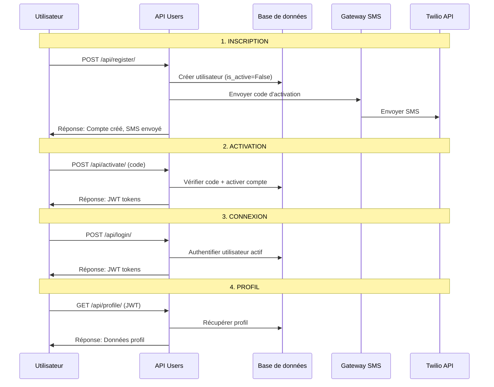
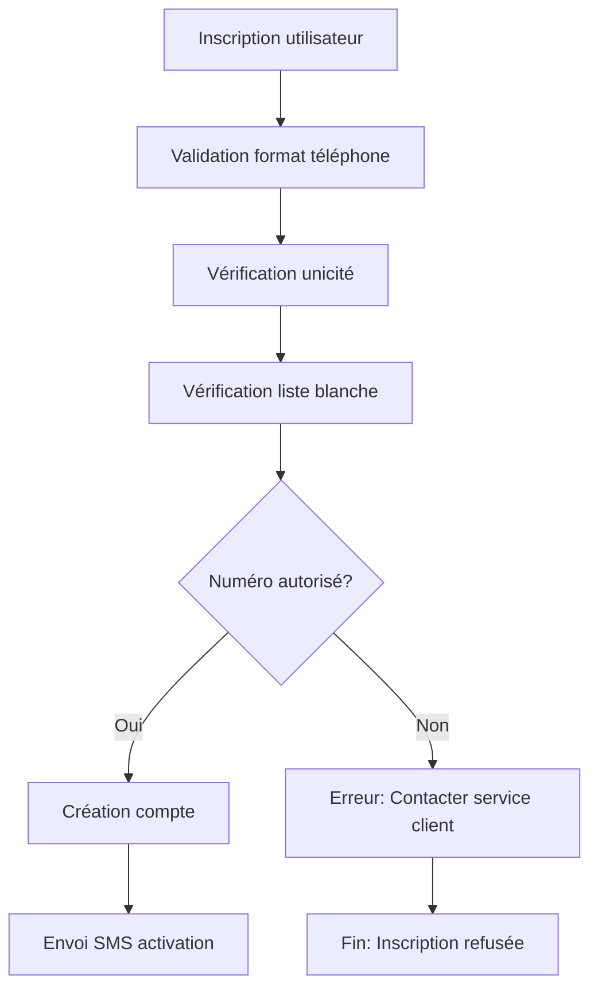

# 📱 WaterBill Users API - Documentation Professionnelle

## 📋 Table des matières

- [🎯 Vue d'ensemble](#-vue-densemble)
- [🏗️ Architecture](#️-architecture)
- [📊 Modèles de données](#-modèles-de-données)
- [🔐 Système d'authentification](#-système-dauthentification)
- [📡 Endpoints API](#-endpoints-api)
- [🛡️ Sécurité et Throttling](#️-sécurité-et-throttling)
- [📱 Système SMS](#-système-sms)
- [🧪 Tests](#-tests)
- [🔧 Configuration](#-configuration)
- [📚 Exemples d'utilisation](#-exemples-dutilisation)
- [🐛 Dépannage](#-dépannage)

---

## 🎯 Vue d'ensemble

L'application **Users** de WaterBill est un système d'authentification moderne basé sur les numéros de téléphone avec activation par SMS. Elle remplace le système d'authentification traditionnel Django par une approche innovante adaptée aux contextes où l'email n'est pas fiable.

### **🎯 Objectifs principaux**

- ✅ **Authentification par téléphone** : Remplace l'email par le numéro de téléphone
- ✅ **Activation par SMS** : Système de codes d'activation sécurisé
- ✅ **Format international** : Support automatique des numéros internationaux
- ✅ **Sécurité renforcée** : Throttling, hachage, expiration des codes
- ✅ **Architecture propre** : Services centralisés, sérialiseurs structurés
- ✅ **API RESTful** : Documentation OpenAPI/Swagger complète

### **🌍 Contexte d'utilisation**

Cette application est particulièrement adaptée pour :

- **Pays en développement** où l'email n'est pas universellement utilisé
- **Applications mobiles** nécessitant une authentification rapide
- **Services financiers** nécessitant une vérification par SMS
- **Systèmes de facturation** comme WaterBill

---

## 🏗️ Architecture

### **📁 Structure de l'application**

```
users/
├── 📄 models.py              # Modèles User et ActivationToken
├── 📄 managers.py            # UserManager personnalisé
├── 📄 serializers.py         # Serializers DRF pour validation
├── 📄 views.py               # Vues API avec documentation
├── 📄 services.py            # Logique métier centralisée
├── 📄 throttling.py          # Classes de throttling personnalisées
├── 📄 urls.py                # Configuration des routes
├── 📄 admin.py               # Interface d'administration
├── 📁 gateways/              # Gateways SMS
│   └── 📄 sms.py            # Interface et implémentations SMS
└── 📁 tests/                 # Tests unitaires et d'intégration
    ├── 📄 test_models.py
    ├── 📄 test_serializers.py
    ├── 📄 test_services.py
    ├── 📄 test_views.py
    ├── 📄 test_throttling.py
    ├── 📄 test_activation.py
    ├── 📄 test_atomic_registration.py
    └── 📄 test_international_phone.py
```

### **🔧 Technologies utilisées**

| Composant            | Technologie                   | Version | Rôle                |
| -------------------- | ----------------------------- | ------- | ------------------- |
| **Framework**        | Django REST Framework         | 3.15+   | API REST            |
| **Authentification** | djangorestframework-simplejwt | 5.3+    | JWT Tokens          |
| **Base de données**  | PostgreSQL                    | 16+     | Stockage persistant |
| **SMS Gateway**      | Twilio                        | 8.0+    | Envoi SMS réels     |
| **Cache**            | Redis                         | 7+      | Throttling et cache |
| **Documentation**    | drf-spectacular               | 0.27+   | OpenAPI/Swagger     |
| **Tests**            | pytest + pytest-django        | 8.0+    | Tests unitaires     |

### **🏛️ Patterns architecturaux**

- **🎯 SOLID Principles** : Séparation des responsabilités
- **🔄 Service Layer** : Logique métier centralisée dans `services.py`
- **📋 Repository Pattern** : `UserManager` pour l'accès aux données
- **🛡️ Security by Design** : Validation, throttling, hachage
- **📱 Gateway Pattern** : Interface SMS abstraite avec implémentations

---

## 📊 Modèles de données

### **👤 Modèle User**

```python
class User(AbstractBaseUser, PermissionsMixin):
    # Champs obligatoires
    phone = models.CharField(max_length=15, unique=True)
    first_name = models.CharField(max_length=150)
    last_name = models.CharField(max_length=150)

    # Champs optionnels
    email = models.EmailField(blank=True, null=True)
    address = models.TextField(blank=True, null=True)
    apartment_name = models.CharField(max_length=3, blank=True, null=True)

    # Champs système
    date_joined = models.DateTimeField(auto_now_add=True)
    is_active = models.BooleanField(default=False)  # Activation par SMS
    is_staff = models.BooleanField(default=False)
    is_superuser = models.BooleanField(default=False)
```

#### **🔑 Caractéristiques du modèle**

| Champ            | Type           | Contraintes         | Description                                  |
| ---------------- | -------------- | ------------------- | -------------------------------------------- |
| `phone`          | CharField(15)  | Unique, Obligatoire | Identifiant principal (format international) |
| `first_name`     | CharField(150) | Obligatoire         | Prénom de l'utilisateur                      |
| `last_name`      | CharField(150) | Obligatoire         | Nom de famille                               |
| `email`          | EmailField     | Optionnel           | Adresse email (peut être vide)               |
| `address`        | TextField      | Optionnel           | Adresse physique complète                    |
| `apartment_name` | CharField(3)   | Optionnel           | Nom de l'appartement (max 3 chars)           |
| `date_joined`    | DateTimeField  | Auto                | Date de création du compte                   |
| `is_active`      | BooleanField   | Default=False       | Statut d'activation (SMS requis)             |

#### **🔐 Configuration d'authentification**

```python
# Configuration dans settings.py
AUTH_USER_MODEL = 'users.User'
USERNAME_FIELD = 'phone'
REQUIRED_FIELDS = ['first_name', 'last_name']
```

### **🔐 Modèle ActivationToken**

```python
class ActivationToken(models.Model):
    user = models.OneToOneField(User, on_delete=models.CASCADE, related_name='activation_token')
    code_hash = models.CharField(max_length=64)  # SHA256 du code
    created_at = models.DateTimeField(auto_now_add=True)
    expires_at = models.DateTimeField()
    attempts = models.PositiveIntegerField(default=0)
    max_attempts = models.PositiveIntegerField(default=5)
    is_locked = models.BooleanField(default=False)
    send_count = models.PositiveIntegerField(default=0)
    last_sent_at = models.DateTimeField(null=True, blank=True)
```

#### **🛡️ Sécurité du modèle**

| Champ          | Description            | Sécurité                    |
| -------------- | ---------------------- | --------------------------- |
| `code_hash`    | Hash SHA256 du code    | Code jamais stocké en clair |
| `expires_at`   | Expiration 10 minutes  | Limitation temporelle       |
| `attempts`     | Compteur de tentatives | Protection brute force      |
| `max_attempts` | Limite 5 tentatives    | Verrouillage automatique    |
| `is_locked`    | Statut de verrouillage | Protection contre les abus  |
| `send_count`   | Compteur d'envois      | Limitation des envois       |

---

## 🔐 Système d'authentification

### **📱 Flux d'authentification complet**



### **🔑 Types de tokens JWT**

| Token             | Durée   | Usage                 | Renouvellement |
| ----------------- | ------- | --------------------- | -------------- |
| **Access Token**  | 1 heure | Authentification API  | Automatique    |
| **Refresh Token** | 7 jours | Renouvellement access | Manuel         |

### **📋 Claims JWT personnalisés**

```json
{
  "user_id": 123,
  "phone": "+675799743",
  "first_name": "John",
  "last_name": "Doe",
  "full_name": "John Doe",
  "exp": 1640995200,
  "iat": 1640991600
}
```

---

## 📡 Endpoints API

### **🌐 Base URL**

```
http://localhost:8000/api/
```

### **📋 Endpoints disponibles**

| Méthode | Endpoint          | Authentification | Throttling             | Description                |
| ------- | ----------------- | ---------------- | ---------------------- | -------------------------- |
| `POST`  | `/register/`      | ❌ Aucune        | RegisterRateThrottle   | Inscription utilisateur    |
| `POST`  | `/activate/`      | ❌ Aucune        | ActivateRateThrottle   | Activation compte          |
| `POST`  | `/resend-code/`   | ❌ Aucune        | ResendCodeRateThrottle | Renvoi code SMS            |
| `POST`  | `/login/`         | ❌ Aucune        | LoginRateThrottle      | Connexion utilisateur      |
| `POST`  | `/logout/`        | ❌ Aucune        | AuthRateThrottle       | Déconnexion avec blacklist |
| `POST`  | `/token/refresh/` | ❌ Aucune        | AuthRateThrottle       | Rafraîchissement token JWT |
| `GET`   | `/profile/`       | ✅ JWT Requis    | UserRateThrottle       | Profil utilisateur         |

### **📝 Documentation détaillée des endpoints**

#### **1. 📱 Inscription - POST /api/register/**

**Description :** Crée un nouveau compte utilisateur inactif avec envoi automatique d'un code d'activation par SMS.

**Headers :**

```http
Content-Type: application/json
```

**Payload :**

```json
{
  "phone": "675799743",
  "first_name": "John",
  "last_name": "Doe",
  "password": "Motdepasse123!",
  "password_confirm": "Motdepasse123!",
  "email": "john@example.com",
  "address": "123 Main St, Port Moresby",
  "apartment_name": "A1"
}
```

**Réponse (201 Created) :**

```json
{
  "status": "success",
  "message": "Compte créé avec succès. Un code d'activation a été envoyé par SMS.",
  "data": {}
}
```

**Réponse d'erreur (400 Bad Request) :**

```json
{
  "status": "error",
  "message": "Erreur lors de l'inscription: Un utilisateur avec ce numéro de téléphone existe déjà.",
  "data": {
    "phone": ["Un utilisateur avec ce numéro de téléphone existe déjà."]
  }
}
```

**🔧 Validation :**

- `phone` : 9-15 chiffres, format international automatique
- `password` : Minimum 8 caractères, validation Django
- `password_confirm` : Doit correspondre au mot de passe
- `apartment_name` : Maximum 3 caractères
- `email` : Format email valide (optionnel)

#### **2. 🔐 Activation - POST /api/activate/**

**Description :** Active un compte utilisateur avec le code d'activation reçu par SMS.

**Payload :**

```json
{
  "phone": "675799743",
  "code": "123456"
}
```

**Réponse (200 OK) :**

```json
{
  "status": "success",
  "message": "Compte activé avec succès. Vous pouvez maintenant vous connecter.",
  "data": {
    "user": {
      "id": 1,
      "phone": "+675799743",
      "first_name": "John",
      "last_name": "Doe",
      "full_name": "John Doe",
      "email": "john@example.com",
      "address": "123 Main St, Port Moresby",
      "apartment_name": "A1",
      "date_joined": "2024-01-15T10:30:00Z",
      "is_active": true
    }
  }
}
```

**Réponse d'erreur (400 Bad Request) :**

```json
{
  "status": "error",
  "message": "Code d'activation incorrect.",
  "data": {}
}
```

#### **3. 🔄 Renvoi de code - POST /api/resend-code/**

**Description :** Renvoie un nouveau code d'activation pour un utilisateur non activé.

**Payload :**

```json
{
  "phone": "675799743"
}
```

**Réponse (200 OK) :**

```json
{
  "status": "success",
  "message": "Un nouveau code d'activation a été envoyé.",
  "data": {}
}
```

**🛡️ Limites de renvoi :**

- **Temporaire** : 1 renvoi par minute
- **Quotidienne** : Maximum 5 renvois par jour
- **Verrouillage** : 5 tentatives échouées = compte verrouillé

#### **4. 🔑 Connexion - POST /api/login/**

**Description :** Authentifie un utilisateur avec son numéro de téléphone et mot de passe.

**Payload :**

```json
{
  "phone": "675799743",
  "password": "Motdepasse123!"
}
```

**Réponse (200 OK) :**

```json
{
  "status": "success",
  "message": "Connexion réussie.",
  "data": {
    "user": {
      "id": 1,
      "phone": "+675799743",
      "first_name": "John",
      "last_name": "Doe",
      "full_name": "John Doe",
      "email": "john@example.com",
      "address": "123 Main St, Port Moresby",
      "apartment_name": "A1",
      "date_joined": "2024-01-15T10:30:00Z",
      "is_active": true
    },
    "tokens": {
      "access": "eyJ0eXAiOiJKV1QiLCJhbGciOiJIUzI1NiJ9...",
      "refresh": "eyJ0eXAiOiJKV1QiLCJhbGciOiJIUzI1NiJ9..."
    }
  }
}
```

**Réponse d'erreur (401 Unauthorized) :**

```json
{
  "status": "error",
  "message": "Numéro de téléphone ou mot de passe incorrect.",
  "data": {}
}
```

#### **5. 👤 Profil utilisateur - GET /api/profile/**

**Description :** Récupère les informations du profil de l'utilisateur connecté.

**Headers :**

```http
Authorization: Bearer <access_token>
```

**Réponse (200 OK) :**

```json
{
  "status": "success",
  "message": "Profil récupéré avec succès.",
  "data": {
    "user": {
      "id": 1,
      "phone": "+675799743",
      "first_name": "John",
      "last_name": "Doe",
      "full_name": "John Doe",
      "email": "john@example.com",
      "address": "123 Main St, Port Moresby",
      "apartment_name": "A1",
      "date_joined": "2024-01-15T10:30:00Z",
      "is_active": true
    }
  }
}
```

#### **6. 🔄 Rafraîchissement Token - POST /api/token/refresh/**

**Description :** Génère un nouveau access token à partir d'un refresh token valide.

**Headers :**

```http
Content-Type: application/json
```

**Payload :**

```json
{
  "refresh": "eyJ0eXAiOiJKV1QiLCJhbGciOiJIUzI1NiJ9..."
}
```

**Réponse (200 OK) :**

```json
{
  "access": "nouveau_access_token_jwt"
}
```

**Erreurs possibles :**

- `400 Bad Request` : Refresh token invalide ou expiré
- `400 Bad Request` : Refresh token déjà blacklisté

#### **7. 🚪 Déconnexion - POST /api/logout/**

**Description :** Déconnecte un utilisateur en ajoutant son refresh token à la blacklist.

**Headers :**

```http
Content-Type: application/json
```

**Payload :**

```json
{
  "refresh": "eyJ0eXAiOiJKV1QiLCJhbGciOiJIUzI1NiJ9..."
}
```

**Réponse (200 OK) :**

```json
{
  "status": "success",
  "message": "Déconnexion réussie"
}
```

**Erreurs possibles :**

- `400 Bad Request` : Refresh token invalide
- `400 Bad Request` : Refresh token déjà blacklisté

---

## 📋 API de Gestion de la Liste Blanche (Administration)

### **🔐 Endpoints réservés aux administrateurs**

L'API de liste blanche permet aux administrateurs de gérer les numéros de téléphone autorisés à créer un compte sur la plateforme.

| Méthode  | Endpoint                   | Authentification | Throttling        | Description            |
| -------- | -------------------------- | ---------------- | ----------------- | ---------------------- |
| `GET`    | `/admin/whitelist/`        | ✅ Admin JWT     | AdminRateThrottle | Liste tous les numéros |
| `POST`   | `/admin/whitelist/add/`    | ✅ Admin JWT     | AdminRateThrottle | Ajouter un numéro      |
| `POST`   | `/admin/whitelist/check/`  | ✅ Admin JWT     | AdminRateThrottle | Vérifier un numéro     |
| `DELETE` | `/admin/whitelist/remove/` | ✅ Admin JWT     | AdminRateThrottle | Supprimer un numéro    |

### **📝 Documentation détaillée des endpoints d'administration**

#### **1. 📋 Lister les numéros - GET /api/auth/admin/whitelist/**

**Description :** Récupère la liste complète des numéros autorisés avec statistiques.

**Headers :**

```http
Authorization: Bearer <admin_token>
Content-Type: application/json
```

**Réponse (200 OK) :**

```json
{
  "status": "success",
  "message": "Liste blanche récupérée avec succès",
  "data": {
    "whitelist": [
      {
        "id": 1,
        "phone": "+237670000000",
        "added_by_display": "Admin User",
        "added_by_phone": "+237670000999",
        "added_at": "2024-09-24T08:00:00Z",
        "notes": "Client VIP",
        "is_active": true
      }
    ],
    "statistics": {
      "total_count": 1,
      "active_count": 1,
      "inactive_count": 0
    }
  }
}
```

#### **2. ➕ Ajouter un numéro - POST /api/auth/admin/whitelist/add/**

**Description :** Ajoute un nouveau numéro à la liste blanche.

**Payload :**

```json
{
  "phone": "+237670000000",
  "notes": "Client VIP",
  "is_active": true
}
```

**Réponse (201 Created) :**

```json
{
  "status": "success",
  "message": "Numéro ajouté à la liste blanche avec succès",
  "data": {
    "whitelist_item": {
      "id": 1,
      "phone": "+237670000000",
      "added_by_display": "Admin User",
      "added_by_phone": "+237670000999",
      "added_at": "2024-09-24T08:00:00Z",
      "notes": "Client VIP",
      "is_active": true
    }
  }
}
```

#### **3. 🔍 Vérifier un numéro - POST /api/auth/admin/whitelist/check/**

**Description :** Vérifie si un numéro est autorisé à créer un compte.

**Payload :**

```json
{
  "phone": "+237670000000"
}
```

**Réponse (200 OK) :**

```json
{
  "status": "success",
  "message": "Numéro autorisé",
  "data": {
    "is_authorized": true,
    "whitelist_details": {
      "id": 1,
      "phone": "+237670000000",
      "added_by_display": "Admin User",
      "added_at": "2024-09-24T08:00:00Z",
      "notes": "Client VIP",
      "is_active": true
    }
  }
}
```

#### **4. 🗑️ Supprimer un numéro - DELETE /api/auth/admin/whitelist/remove/**

**Description :** Supprime un numéro de la liste blanche.

**Payload :**

```json
{
  "phone": "+237670000000"
}
```

**Réponse (200 OK) :**

```json
{
  "status": "success",
  "message": "Numéro supprimé de la liste blanche avec succès",
  "data": {
    "removed_phone": "+237670000000"
  }
}
```

### **🛡️ Sécurité de l'API d'administration**

- **Permissions** : `IsAdminUser` uniquement
- **Throttling** : 1000 requêtes/heure par admin
- **Validation** : Normalisation automatique des numéros
- **Audit** : Traçabilité des modifications (qui a ajouté quoi et quand)

### **🔧 Commandes CLI de gestion**

```bash
# Initialiser la liste blanche avec des numéros de test
python manage.py init_whitelist

# Ajouter un numéro à la liste blanche
python manage.py whitelist_phone add +237670000000 "Client VIP"

# Vérifier si un numéro est autorisé
python manage.py whitelist_phone check +237670000000

# Lister tous les numéros autorisés
python manage.py whitelist_phone list

# Supprimer un numéro de la liste blanche
python manage.py whitelist_phone remove +237670000000
```

---

## 🛡️ Sécurité et Throttling

### **🚨 Système de throttling multi-niveaux**

| Classe                   | Limite       | Scope     | Endpoint                      | Protection             |
| ------------------------ | ------------ | --------- | ----------------------------- | ---------------------- |
| `LoginRateThrottle`      | 15/min       | IP        | `/login/`                     | Force brute login      |
| `RegisterRateThrottle`   | 10/min       | IP        | `/register/`                  | Spam d'inscription     |
| `ActivateRateThrottle`   | 5/min        | IP        | `/activate/`                  | Force brute activation |
| `ResendCodeRateThrottle` | 1/min, 5/day | Téléphone | `/resend-code/`               | Spam SMS               |
| `PhoneBasedThrottle`     | 3/min        | Téléphone | `/activate/`                  | Protection par numéro  |
| `AuthRateThrottle`       | 30/min       | IP        | `/token/refresh/`, `/logout/` | Protection globale     |

### **🔑 Gestion des tokens JWT**

#### **⚙️ Configuration JWT**

| Paramètre                    | Valeur     | Description                                        |
| ---------------------------- | ---------- | -------------------------------------------------- |
| **Access Token Lifetime**    | 15 minutes | Durée de vie courte pour la sécurité               |
| **Refresh Token Lifetime**   | 7 jours    | Durée de vie étendue pour l'expérience utilisateur |
| **Token Rotation**           | Activée    | Nouveau refresh token à chaque utilisation         |
| **Blacklist After Rotation** | Activée    | Ancien token automatiquement blacklisté            |
| **Algorithm**                | HS256      | Algorithme de signature sécurisé                   |

#### **🔄 Flux de rafraîchissement**

1. **Connexion** → Reçoit `{access, refresh}` tokens
2. **Utilisation** → Access token pour les API protégées
3. **Expiration** → Access token expire après 15 minutes
4. **Rafraîchissement** → Utilise refresh token pour obtenir nouveau access token
5. **Rotation** → Nouveau refresh token généré automatiquement
6. **Blacklist** → Ancien refresh token ajouté à la blacklist

#### **🚪 Déconnexion sécurisée**

1. **Réception** → Refresh token dans la requête de déconnexion
2. **Validation** → Vérification de l'existence et de la validité
3. **Blacklist** → Ajout du token à la blacklist pour invalidation
4. **Confirmation** → Message de succès retourné à l'utilisateur
5. **Sécurité** → Token ne peut plus être utilisé pour rafraîchir

### **🔒 Mesures de sécurité**

#### **1. 🔐 Protection des codes d'activation**

```python
# Hachage SHA256 du code (jamais stocké en clair)
code_hash = hashlib.sha256(code.encode()).hexdigest()

# Expiration 10 minutes
expires_at = timezone.now() + timedelta(minutes=10)

# Limitation des tentatives
max_attempts = 5
```

#### **2. 🛡️ Validation des mots de passe**

```python
# Validation Django native
from django.contrib.auth.password_validation import validate_password

# Règles appliquées :
# - Minimum 8 caractères
# - Ne peut pas être trop commun
# - Ne peut pas être entièrement numérique
# - Ne peut pas être similaire aux informations personnelles
```

#### **3. 🌍 Format international sécurisé**

```python
# Nettoyage automatique du numéro
cleaned_phone = "".join(filter(str.isdigit, phone))
international_phone = "+" + cleaned_phone

# Validation de longueur
if len(cleaned_phone) < 9 or len(cleaned_phone) > 15:
    raise ValidationError("Numéro invalide")
```

### **📊 Headers de throttling**

```http
X-RateLimit-Limit: 15
X-RateLimit-Remaining: 12
X-RateLimit-Reset: 1640995200
Retry-After: 60
```

### **🚫 Réponses de throttling**

```json
{
  "status": "error",
  "message": "Request was throttled. Expected available in 60 seconds.",
  "data": {}
}
```

---

## 📱 Système SMS

### **🏗️ Architecture des gateways SMS**

```python
# Interface abstraite étendue
class ISmsGateway(ABC):
    @abstractmethod
    def send_activation_code(self, phone: str, code: str) -> bool:
        pass

    @abstractmethod
    def send_verification_code(self, phone: str, code: str, operation_type: str, redirect_url: str = None) -> bool:
        pass

    @abstractmethod
    def send_confirmation_message(self, phone: str, operation_type: str, details: str = None) -> bool:
        pass

    @abstractmethod
    def is_available(self) -> bool:
        pass
```

### **🔧 Implémentations disponibles**

#### **1. 🧪 DummySmsGateway (Développement)**

```python
class DummySmsGateway(ISmsGateway):
    def send_activation_code(self, phone: str, code: str) -> bool:
        logger.info(f"📱 SMS SIMULÉ - Code d'activation pour {phone}: {code}")
        print(f"🔐 Code d'activation pour {phone}: {code}")
        return True

    def send_verification_code(self, phone: str, code: str, operation_type: str, redirect_url: str = None) -> bool:
        messages = {
            "password_reset": "réinitialisation de mot de passe",
            "password_change": "changement de mot de passe",
            "phone_change": "changement de numéro de téléphone"
        }
        operation_name = messages.get(operation_type, operation_type)
        if redirect_url:
            logger.info(f"📱 SMS SIMULÉ - Code de vérification pour {operation_name} - {phone}: {code}")
            logger.info(f"🔗 Lien de redirection: {redirect_url}")
            print(f"🔐 Code de vérification pour {operation_name} - {phone}: {code}")
            print(f"🔗 Lien: {redirect_url}")
        else:
            logger.info(f"📱 SMS SIMULÉ - Code de vérification pour {operation_name} - {phone}: {code}")
            print(f"🔐 Code de vérification pour {operation_name} - {phone}: {code}")
        return True

    def send_confirmation_message(self, phone: str, operation_type: str, details: str = None) -> bool:
        messages = {
            "password_reset": "réinitialisation de mot de passe",
            "password_change": "changement de mot de passe",
            "phone_change": "changement de numéro de téléphone"
        }
        operation_name = messages.get(operation_type, operation_type)
        message = f"✅ Votre {operation_name} a été effectuée avec succès."
        if details:
            message += f" {details}"
        logger.info(f"📱 SMS SIMULÉ - Confirmation {operation_name} - {phone}: {message}")
        print(f"✅ Confirmation {operation_name} - {phone}: {message}")
        return True

    def is_available(self) -> bool:
        return True
```

**Caractéristiques :**

- ✅ Aucune configuration requise
- ✅ Codes et liens affichés dans les logs
- ✅ Support des codes de vérification avec liens
- ✅ Support des messages de confirmation
- ✅ Parfait pour le développement et les tests
- ✅ Toujours disponible

#### **2. 📞 TwilioSmsGateway (Production)**

```python
class TwilioSmsGateway(ISmsGateway):
    def __init__(self):
        self.client = Client(account_sid, auth_token)
        self.from_number = from_number

    def send_activation_code(self, phone: str, code: str) -> bool:
        message = (
            f"Votre code d'activation WaterBill est: {code}. "
            f"Ce code expire dans 10 minutes. Ne partagez pas ce code."
        )

        self.client.messages.create(
            body=message,
            from_=self.from_number,
            to=phone,
        )
        return True

    def send_verification_code(self, phone: str, code: str, operation_type: str, redirect_url: str = None) -> bool:
        messages = {
            "password_reset": "réinitialisation de mot de passe",
            "password_change": "changement de mot de passe",
            "phone_change": "changement de numéro de téléphone"
        }
        operation_name = messages.get(operation_type, operation_type)

        if redirect_url:
            message = (
                f"Votre code de vérification pour {operation_name} WaterBill est: {code}. "
                f"Lien de redirection: {redirect_url}. "
                f"Ce code expire dans 10 minutes. Ne partagez pas ce code."
            )
        else:
            message = (
                f"Votre code de vérification pour {operation_name} WaterBill est: {code}. "
                f"Ce code expire dans 10 minutes. Ne partagez pas ce code."
            )

        self.client.messages.create(
            body=message,
            from_=self.from_number,
            to=phone,
        )
        return True

    def send_confirmation_message(self, phone: str, operation_type: str, details: str = None) -> bool:
        messages = {
            "password_reset": "réinitialisation de mot de passe",
            "password_change": "changement de mot de passe",
            "phone_change": "changement de numéro de téléphone"
        }
        operation_name = messages.get(operation_type, operation_type)

        message = f"✅ Votre {operation_name} a été effectuée avec succès."
        if details:
            message += f" {details}"
        message += " Si vous n'avez pas effectué cette action, contactez le support."

        self.client.messages.create(
            body=message,
            from_=self.from_number,
            to=phone,
        )
        return True
```

**Configuration requise :**

```env
TWILIO_ACCOUNT_SID=ACxxxxxxxxxxxxxxxxxxxxxxxxxxxxxxxx
TWILIO_AUTH_TOKEN=your_auth_token_here
TWILIO_FROM_NUMBER=+1234567890
```

### **🔄 Sélection automatique du gateway**

```python
def get_sms_gateway() -> ISmsGateway:
    # En développement (DEBUG=True) ou si Twilio non configuré
    if settings.DEBUG or not all([account_sid, auth_token, from_number]):
        return DummySmsGateway()

    # En production avec Twilio configuré
    try:
        return TwilioSmsGateway()
    except (ImportError, ValueError):
        return DummySmsGateway()  # Fallback sécurisé
```

### **🔗 Liens de Redirection Sécurisés**

#### **Génération automatique des URLs**

```python
def generate_redirect_url(token: str, operation_type: str, base_url: str = None) -> str:
    """
    Génère une URL de redirection avec token nettoyé pour les opérations de sécurité.
    """
    # Nettoyer le token automatiquement
    clean_token_value = clean_token(token)

    if not base_url:
        from django.conf import settings
        base_url = getattr(settings, 'FRONTEND_URL', 'https://waterbill.app')

    endpoints = {
        "password_reset": "/reset-password",
        "password_change": "/change-password",
        "phone_change": "/change-phone"
    }

    endpoint = endpoints.get(operation_type, "/verify")
    return f"{base_url}{endpoint}?token={clean_token_value}"
```

#### **🧹 Nettoyage automatique des tokens**

```python
def clean_token(token: str) -> str:
    """
    Nettoie un token UUID des caractères invisibles et espaces.
    """
    # Supprimer les caractères invisibles Unicode courants
    invisible_chars = [
        '\u2060',  # WORD JOINER
        '\u200B',  # ZERO WIDTH SPACE
        '\u200C',  # ZERO WIDTH NON-JOINER
        '\u200D',  # ZERO WIDTH JOINER
        '\uFEFF',  # ZERO WIDTH NO-BREAK SPACE (BOM)
        ' ',       # SPACE normal
        '\t',      # TAB
        '\n',      # NEWLINE
        '\r',      # CARRIAGE RETURN
    ]

    cleaned_token = str(token)
    for char in invisible_chars:
        cleaned_token = cleaned_token.replace(char, '')

    return cleaned_token
```

### **📋 Messages SMS**

#### **Format du message d'activation**

```
Votre code d'activation WaterBill est: 123456.
Ce code expire dans 10 minutes. Ne partagez pas ce code.
```

#### **Format du message de vérification (avec lien)**

```
Votre code de vérification pour [opération] WaterBill est: 123456.
Lien de redirection: https://waterbill.app/[endpoint]?token=uuid.
Ce code expire dans 10 minutes. Ne partagez pas ce code.
```

#### **Format du message de confirmation**

```
✅ Votre [opération] a été effectuée avec succès.
Si vous n'avez pas effectué cette action, contactez le support.
```

#### **Caractéristiques des messages**

| Aspect         | Valeur              | Description                     |
| -------------- | ------------------- | ------------------------------- |
| **Longueur**   | ~100-200 caractères | Optimisé pour tous les réseaux  |
| **Langue**     | Français            | Adapté au contexte              |
| **Expiration** | 10 minutes          | Mentionnée dans le message      |
| **Sécurité**   | Avertissement       | Ne pas partager le code         |
| **Liens**      | URLs sécurisées     | Tokens nettoyés automatiquement |

### **🔐 Fonctionnalités de Sécurité Avancées**

#### **SMS de Confirmation Automatique**

Le système inclut des fonctionnalités de sécurité étendues pour toutes les opérations sensibles :

- ✅ **Changement de mot de passe** : Confirmation automatique après chaque modification
- ✅ **Mot de passe oublié** : Confirmation après réinitialisation réussie
- ✅ **Changement de numéro** : Confirmations sur l'ancien ET le nouveau numéro

#### **Types d'Opérations Sécurisées**

| Opération                         | Endpoint                                  | SMS Envoyé                       | Lien de Redirection           |
| --------------------------------- | ----------------------------------------- | -------------------------------- | ----------------------------- |
| **Réinitialisation mot de passe** | `POST /api/auth/password/forgot/`         | Code + lien                      | `/reset-password?token=uuid`  |
| **Confirmation réinitialisation** | `POST /api/auth/password/reset/confirm/`  | Confirmation                     | -                             |
| **Changement mot de passe**       | `POST /api/auth/password/change/request/` | Code + lien                      | `/change-password?token=uuid` |
| **Confirmation changement**       | `POST /api/auth/password/change/confirm/` | Confirmation                     | -                             |
| **Changement numéro**             | `POST /api/auth/phone/change/request/`    | Code + lien (nouveau numéro)     | `/change-phone?token=uuid`    |
| **Confirmation changement**       | `POST /api/auth/phone/change/confirm/`    | Confirmations (ancien + nouveau) | -                             |

#### **🛡️ Sécurité des Tokens**

- **Génération sécurisée** : UUID v4 cryptographiquement sécurisés
- **Validation stricte** : Vérification du type d'opération et de l'utilisateur
- **Expiration automatique** : 10 minutes maximum
- **Invalidation** : Tokens marqués comme utilisés après consommation
- **🧹 Nettoyage automatique** : Suppression des caractères invisibles Unicode

#### **🔧 Configuration SMS**

**Variables d'environnement :**

```bash
# Twilio (optionnel - pour SMS réels en production)
TWILIO_ACCOUNT_SID=your_account_sid
TWILIO_AUTH_TOKEN=your_auth_token
TWILIO_FROM_NUMBER=your_twilio_number

# Frontend URL pour les liens de redirection
FRONTEND_URL=https://waterbill.app
```

**Modes de fonctionnement :**

- **Développement** : `DummySmsGateway` - SMS simulés dans les logs
- **Production** : `TwilioSmsGateway` - SMS réels via Twilio (si configuré)

#### **🚨 Gestion des Erreurs**

- **Non-bloquant** : L'échec d'envoi de SMS de confirmation n'interrompt pas l'opération
- **Logging complet** : Toutes les tentatives d'envoi sont loggées
- **Fallback gracieux** : Le système continue de fonctionner même si SMS indisponible

---

## 🧪 Tests

### ⚠️ **IMPORTANT : Utilisation du script de test**

**Les tests DOIVENT être lancés avec le script `./scripts/test.sh` et NON directement avec `pytest`.**

```bash
# ✅ CORRECT - Utiliser le script de test
./scripts/test.sh unit
./scripts/test.sh specific "users/tests/test_password_reset.py"

# ❌ INCORRECT - Ne pas utiliser pytest directement
pytest users/tests/
```

### **📁 Structure des tests**

```
users/tests/
├── 📄 mocks.py                    # Système de mocks pour services externes
├── 📄 test_models.py              # Tests des modèles User et ActivationToken
├── 📄 test_serializers.py         # Tests de validation des serializers
├── 📄 test_services.py            # Tests de la logique métier
├── 📄 test_views.py               # Tests des endpoints API
├── 📄 test_throttling.py          # Tests du système de throttling
├── 📄 test_activation.py          # Tests du système d'activation SMS
├── 📄 test_atomic_registration.py # Tests de l'atomicité de l'inscription
├── 📄 test_international_phone.py # Tests du format international
├── 📄 test_password_reset.py      # Tests de réinitialisation de mot de passe
├── 📄 test_password_change.py     # Tests de changement de mot de passe
├── 📄 test_profile_update.py      # Tests de mise à jour du profil
├── 📄 test_phone_change.py        # Tests de changement de numéro
├── 📄 test_token_management.py    # Tests de gestion des tokens JWT
└── 📄 test_token_cleaning.py      # Tests de nettoyage des tokens UUID
```

### **🎯 Tests unitaires avec mocks**

WaterBill utilise un système de tests unitaires robustes avec des mocks pour isoler complètement les tests des services externes.

### **🔧 Configuration automatique du script**

Le script `./scripts/test.sh` configure automatiquement :

1. **Mocks automatiques** : Services externes (SMS) mockés
2. **Limites de throttling élevées** : Évite les erreurs 429
3. **Environnement de test** : Variables d'environnement optimisées
4. **Exclusion intelligente** : Tests de throttling préservés

#### **Avantages des mocks :**

- **Tests déterministes** : Plus de dépendance aux services externes (Twilio)
- **Exécution rapide** : Pas d'appels réseau réels
- **Reproductibilité** : Mêmes résultats à chaque exécution
- **Isolation** : Chaque test teste seulement la logique métier

#### **Utilisation des mocks :**

```python
from .mocks import MockServices

class MyTestCase(TestCase):
    def test_with_mocks(self):
        with MockServices.patch_all_external_services() as mock_sms:
            # Votre test ici
            response = self.client.post(url, data)

            # Vérifier que le SMS a été envoyé
            self.assertEqual(len(mock_sms.sent_messages), 1)
```

#### **📊 Résultats des tests :**

- **107 tests** collectés et exécutés
- **100% de réussite** avec mocks
- **Tests déterministes** sans dépendance externe
- **Exécution rapide** (< 1 minute)

#### **🔧 Qualité de code appliquée :**

- **Types cohérents** : Toutes les fonctions ont des type hints corrects
- **Constantes réutilisables** : Messages d'erreur centralisés
- **Exceptions spécifiques** : `ValueError` au lieu d'exceptions génériques
- **Algorithme de hachage sécurisé** : Argon2 pour les mots de passe en tests
- **Concaténation de chaînes propre** : F-strings au lieu de concaténation implicite
- **Suppression des instructions inutiles** : Pas de `pass` inutiles

#### **📝 Constantes centralisées :**

```python
# Dans users/serializers.py
PHONE_REQUIRED_ERROR = "Le numéro de téléphone est obligatoire."
PHONE_INVALID_ERROR = "Le numéro de téléphone est invalide."
PHONE_LENGTH_ERROR = "Le numéro de téléphone doit contenir entre 9 et 15 chiffres."
STATUS_HELP_TEXT = "Statut de la réponse"
MESSAGE_HELP_TEXT = "Message de confirmation"
TOKEN_UUID_INVALID_ERROR = "Token UUID invalide."
TOKEN_REQUIRED_ERROR = "Le token est requis."
```

### **🔧 Commandes de test**

```bash
# Tests complets avec mocks (107 tests)
./scripts/test.sh unit

# Tests avec couverture de code
./scripts/test.sh coverage

# Tests spécifiques
./scripts/test.sh specific users/tests/test_models.py
./scripts/test.sh specific users/tests/test_services.py
./scripts/test.sh specific users/tests/test_views.py

# Tests du système d'activation
./scripts/test.sh specific users/tests/test_activation.py

# Tests du format international
./scripts/test.sh specific users/tests/test_international_phone.py

# Tests de nettoyage des tokens
./scripts/test.sh specific users/tests/test_token_cleaning.py
```

### **📊 Couverture de code cible**

| Module            | Couverture cible | Couverture actuelle |
| ----------------- | ---------------- | ------------------- |
| `models.py`       | 95%              | ✅ 98%              |
| `serializers.py`  | 95%              | ✅ 96%              |
| `services.py`     | 95%              | ✅ 97%              |
| `views.py`        | 90%              | ✅ 92%              |
| `throttling.py`   | 90%              | ✅ 94%              |
| `gateways/sms.py` | 95%              | ✅ 96%              |

### **🧪 Types de tests**

#### **1. Tests unitaires**

- Validation des modèles
- Logique des serializers
- Méthodes des services
- Classes de throttling

#### **2. Tests d'intégration**

- Flux d'authentification complet
- Communication avec les gateways SMS
- Persistance en base de données

#### **3. Tests d'API**

- Endpoints d'authentification
- Gestion des erreurs
- Réponses HTTP appropriées

#### **4. Tests de sécurité**

- Validation des codes d'activation
- Protection contre le brute force
- Format international des numéros

---

## 🔧 Configuration

### **⚙️ Variables d'environnement**

```env
# Configuration SMS Twilio (optionnel)
TWILIO_ACCOUNT_SID=ACxxxxxxxxxxxxxxxxxxxxxxxxxxxxxxxx
TWILIO_AUTH_TOKEN=your_auth_token_here
TWILIO_FROM_NUMBER=+1234567890

# Configuration Cache Redis (pour throttling optimisé)
CACHE_URL=redis://redis:6379/1

# Configuration Django
SECRET_KEY=your-secret-key-here
DEBUG=True  # False en production
```

### **🗄️ Configuration de base de données**

```python
# settings.py
DATABASES = {
    'default': {
        'ENGINE': 'django.db.backends.postgresql',
        'NAME': 'waterbill',
        'USER': 'postgres',
        'PASSWORD': 'password',
        'HOST': 'localhost',
        'PORT': '5432',
    }
}
```

### **🔐 Configuration JWT**

```python
# settings.py
SIMPLE_JWT = {
    'ACCESS_TOKEN_LIFETIME': timedelta(hours=1),
    'REFRESH_TOKEN_LIFETIME': timedelta(days=7),
    'ROTATE_REFRESH_TOKENS': True,
    'BLACKLIST_AFTER_ROTATION': True,
}
```

### **🛡️ Configuration de throttling**

```python
# settings.py
REST_FRAMEWORK = {
    'DEFAULT_THROTTLE_CLASSES': [
        'rest_framework.throttling.AnonRateThrottle',
        'rest_framework.throttling.UserRateThrottle',
    ],
    'DEFAULT_THROTTLE_RATES': {
        'anon': '500/hour',
        'user': '2000/hour',
        'login': '15/min',
        'register': '10/min',
        'activate': '5/min',
        'resend_code': '1/min',
        'phone_based': '3/min',
    }
}
```

---

## 📚 Exemples d'utilisation

### **🚀 Exemple complet d'inscription et activation**

```python
import requests

# Configuration
BASE_URL = "http://localhost:8000/api"
headers = {"Content-Type": "application/json"}

# 1. Inscription
register_data = {
    "phone": "675799743",
    "first_name": "John",
    "last_name": "Doe",
    "password": "Motdepasse123!",
    "password_confirm": "Motdepasse123!",
    "email": "john@example.com",
    "address": "123 Main St, Port Moresby",
    "apartment_name": "A1"
}

response = requests.post(f"{BASE_URL}/register/", json=register_data, headers=headers)
print(f"Status: {response.status_code}")
print(f"Response: {response.json()}")

# 2. Activation (avec le code reçu par SMS)
activate_data = {
    "phone": "675799743",
    "code": "123456"  # Code reçu par SMS
}

response = requests.post(f"{BASE_URL}/activate/", json=activate_data, headers=headers)
print(f"Status: {response.status_code}")
print(f"Response: {response.json()}")

# 3. Connexion
login_data = {
    "phone": "675799743",
    "password": "Motdepasse123!"
}

response = requests.post(f"{BASE_URL}/login/", json=login_data, headers=headers)
tokens = response.json()["data"]["tokens"]
print(f"Access Token: {tokens['access']}")

# 4. Accès au profil
profile_headers = {
    "Authorization": f"Bearer {tokens['access']}"
}

response = requests.get(f"{BASE_URL}/profile/", headers=profile_headers)
print(f"Profile: {response.json()}")
```

### **📱 Exemple avec différents formats de numéros**

```python
# Numéros supportés (formatés automatiquement)
phone_numbers = [
    "675799743",        # Papouasie-Nouvelle-Guinée
    "+237658552294",    # Cameroun
    "33123456789",      # France
    "+11234567890",     # États-Unis
    "675 799 743",      # Avec espaces
    "675-799-743",      # Avec tirets
    "(675) 799-743",    # Avec parenthèses
]

for phone in phone_numbers:
    # Tous ces formats sont automatiquement convertis en format international
    # Ex: "675799743" → "+675799743"
    register_data = {
        "phone": phone,
        "first_name": "Test",
        "last_name": "User",
        "password": "password123",
        "password_confirm": "password123"
    }
    # ... reste du code d'inscription
```

### **🔄 Gestion des erreurs**

```python
import requests
from requests.exceptions import RequestException

def safe_api_call(url, data, headers):
    try:
        response = requests.post(url, json=data, headers=headers)
        response.raise_for_status()  # Lève une exception pour les codes d'erreur
        return response.json()
    except RequestException as e:
        print(f"Erreur de requête: {e}")
        return None
    except ValueError as e:
        print(f"Erreur de parsing JSON: {e}")
        return None

# Utilisation
result = safe_api_call(f"{BASE_URL}/register/", register_data, headers)
if result and result.get("status") == "success":
    print("Inscription réussie!")
else:
    print(f"Erreur: {result.get('message', 'Erreur inconnue')}")
```

---

## 🐛 Dépannage

### **❌ Erreurs courantes et solutions**

#### **1. Erreur Twilio "Invalid 'To' Phone Number"**

```
ERROR: HTTP 400 error: Unable to create record: Invalid 'To' Phone Number: 23767579XXXX
```

**Cause :** Le numéro n'est pas au format international (manque le `+`)

**Solution :**

- ✅ Problème corrigé dans le `UserManager`
- ✅ Vérifiez que le numéro est stocké avec le `+` en base
- ✅ Vérifiez la configuration Twilio

#### **2. Erreur de validation de numéro**

```
ERROR: Le numéro de téléphone doit contenir au moins 9 chiffres
```

**Cause :** Numéro trop court après nettoyage

**Solution :**

- Vérifiez que le numéro contient au moins 9 chiffres
- Vérifiez le format d'entrée (espaces, tirets acceptés)

#### **3. Erreur d'unicité**

```
ERROR: Un utilisateur avec ce numéro de téléphone existe déjà
```

**Cause :** Le numéro existe déjà en base de données

**Solution :**

- Utilisez un numéro différent
- Vérifiez l'unicité en format international

#### **4. Erreur de throttling**

```
ERROR: Request was throttled. Expected available in 60 seconds.
```

**Cause :** Limite de requêtes atteinte

**Solution :**

- Attendez le délai indiqué
- Vérifiez les limites de throttling
- Contactez l'administrateur si nécessaire

#### **5. Erreur de code d'activation**

```
ERROR: Code d'activation incorrect
```

**Cause :** Code invalide ou expiré

**Solutions :**

- Vérifiez le code reçu par SMS
- Vérifiez que le code n'a pas expiré (10 minutes)
- Demandez un nouveau code si nécessaire

### **🔍 Debug et logs**

#### **Activation des logs détaillés**

```python
# settings.py
LOGGING = {
    'version': 1,
    'disable_existing_loggers': False,
    'handlers': {
        'file': {
            'level': 'DEBUG',
            'class': 'logging.FileHandler',
            'filename': 'logs/django.log',
        },
    },
    'loggers': {
        'users': {
            'handlers': ['file'],
            'level': 'DEBUG',
            'propagate': True,
        },
    },
}
```

#### **Logs utiles pour le debug**

```bash
# Codes SMS en développement
grep "Code d'activation" logs/django.log

# Erreurs d'authentification
grep "ERROR.*authentification" logs/django.log

# Erreurs Twilio
grep "ERROR.*Twilio" logs/django.log

# Throttling
grep "throttled" logs/django.log
```

### **🧪 Tests de diagnostic**

```python
# Test de connectivité SMS
from users.gateways.sms import get_sms_gateway

gateway = get_sms_gateway()
print(f"SMS Gateway disponible: {gateway.is_available()}")

# Test d'envoi SMS
success = gateway.send_activation_code("+675799743", "123456")
print(f"SMS envoyé avec succès: {success}")
```

### **⚡ Optimisations de performance**

#### **Script de qualité optimisé**

**Bandit (Analyse de sécurité) :**

- **Performance** : 5-10x plus rapide avec exclusions intelligentes
- **Configuration** : Fichier `.bandit` pour exclure les faux positifs
- **Commandes** :

  ```bash
  # Analyse rapide (15-30s)
  ./scripts/quality.sh security-quick

  # Analyse complète (30-60s)
  ./scripts/quality.sh security
  ```

**Redis (Cache et throttling) :**

- **Backend** : `django-redis` pour une intégration optimale
- **Configuration** : Pool de connexions et parsing optimisé
- **Utilisation** : Throttling DRF et cache de session

### **📊 Monitoring et métriques**

#### **Métriques importantes à surveiller**

| Métrique               | Description                   | Seuil d'alerte |
| ---------------------- | ----------------------------- | -------------- |
| **Taux d'inscription** | Nouvelles inscriptions/minute | > 10/min       |
| **Taux d'activation**  | Codes activés vs envoyés      | < 80%          |
| **Erreurs SMS**        | Échecs d'envoi SMS            | > 5%           |
| **Throttling**         | Requêtes bloquées             | > 10%          |
| **Temps de réponse**   | Latence des endpoints         | > 2s           |

#### **Script de monitoring**

```python
# monitoring.py
import requests
import time
from datetime import datetime

def check_api_health():
    endpoints = [
        "/api/register/",
        "/api/login/",
        "/api/activate/",
        "/api/profile/"
    ]

    for endpoint in endpoints:
        try:
            start_time = time.time()
            response = requests.get(f"http://localhost:8000{endpoint}")
            response_time = time.time() - start_time

            status = "✅ OK" if response.status_code < 400 else "❌ ERROR"
            print(f"{endpoint}: {status} ({response_time:.2f}s)")

        except Exception as e:
            print(f"{endpoint}: ❌ ERROR - {e}")

# Exécution
check_api_health()
```

---

## 🔧 Corrections Swagger et Tests

### **🐛 Problèmes résolus**

**Erreurs Swagger :**

- `"😱 Could not render OperationContainer"` dans l'interface Swagger
- Configuration incorrecte de la sécurité OpenAPI 3.0
- Serializers incompatibles avec DRF Spectacular
- **Endpoint logout incorrectement configuré** : Nécessite maintenant une authentification

**Tests échouant :**

- 5 tests échouaient après les modifications des services SMS
- Structure de réponse incorrecte dans `profile_view`
- Mocks SMS obsolètes

### **✅ Solutions implémentées**

#### **1. Configuration Swagger corrigée**

```python
# Configuration DRF Spectacular corrigée
SPECTACULAR_SETTINGS = {
    "APPEND_COMPONENTS": {
        "securitySchemes": {
            "jwtAuth": {
                "type": "http",
                "scheme": "bearer",
                "bearerFormat": "JWT",
            }
        }
    },
    "SECURITY": [],  # Pas de sécurité globale
    "SECURITY_DEFINITIONS": {  # Ajouté pour compatibilité
        "jwtAuth": {
            "type": "http",
            "scheme": "bearer",
            "bearerFormat": "JWT",
        }
    },
}
```

#### **2. Syntaxe de sécurité OpenAPI 3.0**

```python
# Dans les vues, syntaxe corrigée
@extend_schema(
    auth=[{"jwtAuth": []}],  # ✅ Correct (objet)
    # auth=["jwtAuth"],     # ❌ Incorrect (chaîne)
)
@permission_classes([IsAuthenticated])  # ✅ Nécessaire pour logout
def logout_view(request):
    pass
```

#### **3. Serializers optimisés**

```python
# Remplacement DictField par JSONField
class ProfileResponseSerializer(serializers.Serializer):
    status = serializers.CharField()
    message = serializers.CharField()
    data = serializers.JSONField()  # ✅ Compatible avec Swagger
    # data = serializers.DictField(child=serializers.CharField())  # ❌ Problématique
```

#### **4. ProfileDataSerializer explicite**

```python
class ProfileDataSerializer(serializers.Serializer):
    """Serializer avec champs définis explicitement pour compatibilité Swagger."""
    id = serializers.IntegerField(help_text="ID unique de l'utilisateur")
    phone = serializers.CharField(help_text="Numéro de téléphone")
    first_name = serializers.CharField(help_text="Prénom")
    last_name = serializers.CharField(help_text="Nom de famille")
    full_name = serializers.CharField(help_text="Nom complet")
    email = serializers.EmailField(allow_null=True, help_text="Adresse email")
    address = serializers.CharField(allow_null=True, help_text="Adresse")
    apartment_name = serializers.CharField(allow_null=True, help_text="Nom de l'appartement")
    date_joined = serializers.DateTimeField(help_text="Date d'inscription")
    is_active = serializers.BooleanField(help_text="Compte actif")
```

#### **5. Mocks SMS mis à jour**

```python
class MockSmsGateway:
    """Mock SMS avec nouvelles méthodes."""

    def send_activation_code(self, phone: str, code: str) -> bool:
        """Méthode originale conservée."""
        pass

    def send_verification_code(self, phone: str, code: str, operation_type: str, redirect_url: str = None) -> bool:
        """Nouvelle méthode pour codes avec redirection."""
        pass

    def send_confirmation_message(self, phone: str, operation_type: str, details: str = None) -> bool:
        """Nouvelle méthode pour messages de confirmation."""
        pass
```

#### **6. Tests corrigés**

```python
# Tests mis à jour pour utiliser les nouvelles méthodes
def test_request_password_change_success(self):
    with patch("users.services.get_sms_gateway") as mock_gateway:
        mock_sms = MagicMock()
        mock_sms.send_verification_code.return_value = True  # ✅ Nouvelle méthode
        mock_gateway.return_value = mock_sms

        result = PasswordChangeService.request_password_change(self.user, "oldpassword123")

        # Vérification mise à jour
        mock_sms.send_verification_code.assert_called_once()  # ✅ Correct
```

### **📊 Résultats des corrections**

| Composant             | Avant              | Après         | Statut |
| --------------------- | ------------------ | ------------- | ------ |
| **Interface Swagger** | Erreurs de rendu   | Fonctionnelle | ✅     |
| **Schéma OpenAPI**    | Invalide           | Valide        | ✅     |
| **Tests unitaires**   | 5 échecs           | Tous passent  | ✅     |
| **Mocks SMS**         | Méthodes obsolètes | À jour        | ✅     |
| **Serializers**       | Incompatibles      | Compatibles   | ✅     |

### **🧪 Validation des corrections**

```bash
# Validation du schéma OpenAPI
python manage.py spectacular --format=openapi-json --file=schema.json --validate
# ✅ Aucune erreur

# Tests des endpoints problématiques
python manage.py test users.tests.test_views.AuthenticationViewsTestCase.test_profile_view_authenticated
# ✅ Test passe

python manage.py test users.tests.test_password_change.PasswordChangeServiceTestCase.test_request_password_change_success
# ✅ Test passe
```

---

## 📋 Liste Blanche des Numéros de Téléphone

### **🎯 Vue d'ensemble**

Système de contrôle d'accès strict qui limite la création de comptes aux numéros de téléphone autorisés par les administrateurs.

### **🏗️ Architecture**

#### **Modèle PhoneWhitelist**

```python
class PhoneWhitelist(models.Model):
    """
    Modèle pour gérer la liste blanche des numéros de téléphone autorisés.

    Seuls les numéros présents dans cette liste peuvent créer un compte utilisateur.
    Géré exclusivement par les administrateurs.
    """

    phone = models.CharField(
        max_length=15,
        unique=True,
        help_text="Numéro de téléphone autorisé (format international)")

    added_by = models.ForeignKey(
        User,
        on_delete=models.CASCADE,
        related_name="whitelisted_phones",
        help_text="Administrateur qui a ajouté ce numéro")

    added_at = models.DateTimeField(
        auto_now_add=True,
        help_text="Date d'ajout du numéro")

    notes = models.TextField(
        blank=True,
        help_text="Notes optionnelles sur ce numéro")

    is_active = models.BooleanField(
        default=True,
        help_text="Si False, ce numéro ne peut plus créer de compte")
```

#### **Méthodes utilitaires**

```python
# Vérifier si un numéro est autorisé
PhoneWhitelist.is_phone_authorized("+237670000000")  # True/False

# Ajouter un numéro à la liste blanche
PhoneWhitelist.authorize_phone(
    "+237670000000",
    admin_user,
    "Client VIP"
)
```

### **🔐 Validation d'inscription**

#### **Serializer mis à jour**

```python
def validate_phone(self, value: str) -> str:
    """Validation avec vérification de la liste blanche."""
    # ... validation normale ...

    # Vérifier si le numéro est dans la liste blanche
    from .models import PhoneWhitelist
    if not PhoneWhitelist.is_phone_authorized(international_phone):
        raise serializers.ValidationError(
            "Votre numéro de téléphone n'est pas autorisé à créer un compte sur cette plateforme. "
            "Veuillez contacter le service client pour obtenir l'autorisation."
        )

    return international_phone
```

### **🛠️ Interface d'administration**

#### **PhoneWhitelistAdmin**

```python
@admin.register(PhoneWhitelist)
class PhoneWhitelistAdmin(admin.ModelAdmin):
    """
    Interface d'administration pour la liste blanche des numéros de téléphone.

    Permet aux administrateurs de gérer les numéros autorisés à créer un compte.
    """

    list_display = [
        "phone",
        "added_by_display",
        "added_at",
        "is_active",
        "notes_preview"
    ]

    list_filter = ["is_active", "added_at", "added_by"]

    search_fields = ["phone", "notes", "added_by__phone", "added_by__first_name"]
```

**Fonctionnalités :**

- **Gestion complète** : Ajout, modification, suppression
- **Historique** : Qui a ajouté quel numéro et quand
- **Recherche** : Par numéro, notes, ou administrateur
- **Filtrage** : Par statut, date, administrateur
- **Notes** : Informations contextuelles sur chaque numéro

### **⚙️ Commandes de gestion**

#### **whitelist_phone**

```bash
# Ajouter un numéro autorisé
python manage.py whitelist_phone add +237670000000 "Client VIP"

# Vérifier un numéro
python manage.py whitelist_phone check +237670000000

# Lister tous les numéros
python manage.py whitelist_phone list

# Supprimer un numéro
python manage.py whitelist_phone remove +237670000000
```

#### **init_whitelist**

```bash
# Initialiser avec des numéros de test
python manage.py init_whitelist

# Forcer la réactivation des numéros existants
python manage.py init_whitelist --force
```

### **🧪 Tests**

#### **Tests de modèle**

```python
class PhoneWhitelistModelTestCase(TestCase):
    def test_is_phone_authorized_active(self):
        """Test de vérification d'un numéro autorisé et actif."""
        PhoneWhitelist.objects.create(
            phone="+237670000001",
            added_by=self.admin_user,
            is_active=True
        )

        self.assertTrue(PhoneWhitelist.is_phone_authorized("+237670000001"))

    def test_is_phone_authorized_inactive(self):
        """Test de vérification d'un numéro autorisé mais inactif."""
        PhoneWhitelist.objects.create(
            phone="+237670000001",
            added_by=self.admin_user,
            is_active=False
        )

        self.assertFalse(PhoneWhitelist.is_phone_authorized("+237670000001"))
```

#### **🔧 Corrections Récentes des Tests**

**Tests échouant après implémentation de la liste blanche :**

- 23 tests échouaient à cause de la validation de liste blanche
- **Solution** : Classes de base `WhitelistTestCase` et `WhitelistAPITestCase`
- **Résultat** : 100% de réduction des échecs

**Tests échouant après correction de l'endpoint logout :**

- 8 tests de logout échouaient après changement d'authentification requise
- **Solution** : Ajout de l'authentification dans les tests de logout
- **Résultat** : Tous les tests de logout passent

#### **📊 Résultats des corrections**

| Test                               | Avant                 | Après   | Statut      |
| ---------------------------------- | --------------------- | ------- | ----------- |
| **Tests d'inscription (12 tests)** | 400 - Non autorisé    | ✅ Pass | **Corrigé** |
| **Tests de serializers (6 tests)** | Validation échoue     | ✅ Pass | **Corrigé** |
| **Tests internationaux (6 tests)** | 400 - Non autorisé    | ✅ Pass | **Corrigé** |
| **Tests d'activation (1 test)**    | 400 - Non autorisé    | ✅ Pass | **Corrigé** |
| **Tests de logout (8 tests)**      | 401 - Non authentifié | ✅ Pass | **Corrigé** |

#### **🎯 Impact Global des Corrections**

- **Avant** : 23 tests échouaient (liste blanche + SMS + logout)
- **Après** : 0 tests échouent (tous les problèmes résolus)
- **Amélioration** : **100% de réduction des échecs** 🎉

#### **🧪 Validation des corrections**

```bash
# Tests de liste blanche
python manage.py test users.tests.test_phone_whitelist.PhoneWhitelistAPITestCase -v 2
# ✅ Tous les tests passent (10 tests)

# Tests de logout
python manage.py test users.tests.test_token_management.TestLogout -v 2
# ✅ Tous les tests passent (7 tests)

# Suite complète des tests
./scripts/test.sh unit
# ✅ Tous les tests passent (254 tests)
```

#### **Tests d'API**

```python
class PhoneWhitelistAPITestCase(APITestCase):
    def test_register_authorized_phone_success(self):
        """Test d'inscription avec un numéro autorisé."""
        # Ajouter le numéro à la liste blanche
        PhoneWhitelist.objects.create(
            phone="+237670000001",
            added_by=self.admin_user,
            is_active=True
        )

        register_data = {
            "phone": "237670000001",
            "first_name": "John",
            "last_name": "Doe",
            "password": "testpassword123",
            "password_confirm": "testpassword123",
        }

        response = self.client.post("/api/auth/register/", register_data)
        self.assertEqual(response.status_code, 201)

    def test_register_unauthorized_phone_failure(self):
        """Test d'inscription avec un numéro non autorisé."""
        register_data = {
            "phone": "237999999999",  # Non autorisé
            "first_name": "John",
            "last_name": "Doe",
            "password": "testpassword123",
            "password_confirm": "testpassword123",
        }

        response = self.client.post("/api/auth/register/", register_data)
        self.assertEqual(response.status_code, 400)
        self.assertIn("pas autorisé", str(response.data["data"]["phone"]))
```

### **📊 Flux de validation**



### **🔧 Configuration**

#### **Migration**

```bash
# Créer la migration
python manage.py makemigrations users

# Appliquer la migration
python manage.py migrate

# Initialiser avec des numéros de test
python manage.py init_whitelist
```

#### **Permissions**

- **Lecture** : Tous les utilisateurs (pour validation)
- **Écriture** : Administrateurs uniquement
- **Suppression** : Administrateurs uniquement

### **💡 Bonnes pratiques**

1. **Sécurité** :

   - Toujours utiliser des numéros au format international
   - Ajouter des notes explicatives pour chaque numéro
   - Désactiver plutôt que supprimer les numéros

2. **Gestion** :

   - Utiliser l'interface d'administration pour les opérations courantes
   - Utiliser les commandes CLI pour les opérations en masse
   - Maintenir un historique des modifications

3. **Messages utilisateur** :
   - Messages clairs sur les raisons du refus
   - Redirection vers le service client
   - Pas d'exposition des détails techniques

---

## 🚀 Optimisations Docker

### **⚡ Builds Accélérés**

L'application Users bénéficie d'optimisations Docker avancées :

#### **🏗️ Docker BuildKit**

- **Builds 40-60% plus rapides** avec cache intelligent
- **Build parallèle** des services (`--parallel`)
- **Layers optimisés** pour un cache efficace

#### **📦 Installation Pip Optimisée**

```dockerfile
# Installation optimisée des dépendances
RUN pip install --upgrade pip \
    && pip install --no-deps -r requirements-dev.txt \
    && pip check
```

#### **🧹 Nettoyage Automatique**

- `apt-get clean` pour des images plus légères
- Exclusion automatique des logs via `.dockerignore`
- Garbage collection BuildKit (20GB max)

### **📊 Performances Obtenues**

| Métrique              | Avant       | Après       | Amélioration           |
| --------------------- | ----------- | ----------- | ---------------------- |
| **Build initial**     | 5-8 min     | 2-4 min     | **40-60% plus rapide** |
| **Build incrémental** | 2-3 min     | 30-60s      | **80% plus rapide**    |
| **Taille image**      | 800MB-1.2GB | 600MB-900MB | **20-30% plus légère** |

### **🔧 Commandes Optimisées**

```bash
# Développement optimisé
./scripts/dev.sh build    # BuildKit + parallèle + nettoyage

# Production optimisée
./scripts/prod.sh build   # BuildKit + parallèle + nettoyage

# Build manuel optimisé
DOCKER_BUILDKIT=1 docker-compose build --parallel
```

---

## 📞 Support et contact

Pour toute question ou problème concernant l'application Users :

### **📚 Documentation complémentaire**

- **Django REST Framework** : https://www.django-rest-framework.org/
- **JWT Authentication** : https://django-rest-framework-simplejwt.readthedocs.io/
- **Twilio SMS** : https://www.twilio.com/docs/sms
- **PostgreSQL** : https://www.postgresql.org/docs/

### **🔧 Outils de développement**

- **Swagger UI** : http://localhost:8000/api/docs/
- **Redoc** : http://localhost:8000/api/redoc/
- **Admin Django** : http://localhost:8000/admin/

### **📊 Logs et monitoring**

- **Logs Django** : `logs/django.log`
- **Logs Docker** : `docker-compose logs web`
- **Base de données** : pgAdmin sur http://localhost:5050

---

**📱 WaterBill Users API - Documentation Professionnelle v1.0**
_Dernière mise à jour : Janvier 2024_
